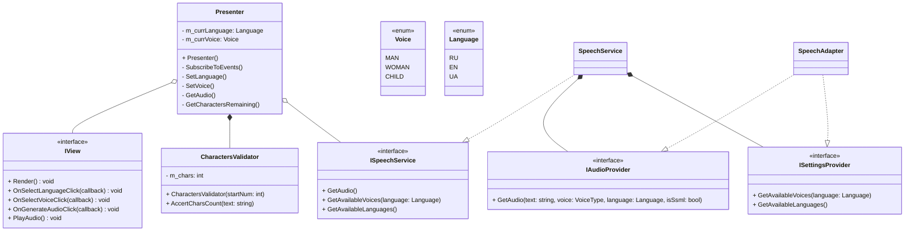

```mermaid
classDiagram
    class IView {
        <<interface>>
        + Render() void
        + OnSelectLanguageClick(callback) void
        + OnSelectVoiceClick(callback) void
        + OnGenerateAudioClick(callback) void
        + PlayAudio() void
    }

    class Presenter {
        - m_currLanguage: Language
        - m_currVoice: Voice

        + Presenter()
        - SubscribeToEvents()
        - SetLanguage()
        - SetVoice()
        - GetAudio()
        - GetCharactersRemaining()
    }

    class IAudioProvider {
        <<interface>>
        + GetAudio(text: string, voice: VoiceType, language: Language, isSsml: bool)
    }

    class ISettingsProvider {
        <<interface>>
        + GetAvailableVoices(language: Language)
        + GetAvailableLanguages()
    }

    class ISpeechService {
        <<interface>>
        + GetAudio()
        + GetAvailableVoices(language: Language)
        + GetAvailableLanguages()
    }

    class CharactersValidator {
        - m_chars: int

        + CharactersValidator(startNum: int)
        + AccertCharsCount(text: string)
    }

    class Voice {
        <<enum>>
        MAN
        WOMAN
        CHILD
    }

    class Language {
        <<enum>>
        RU
        EN
        UA
    }

%% class GoogleSpeechAdapter
%% class AnotherSpeechAdapter

    class SpeechAdapter

    Presenter o-- IView
    Presenter *-- CharactersValidator
    Presenter o-- ISpeechService

    SpeechService ..|> ISpeechService
    SpeechService *-- IAudioProvider
    SpeechService *-- ISettingsProvider

    SpeechAdapter ..|> IAudioProvider
    SpeechAdapter ..|> ISettingsProvider

%% GoogleSpeechAdapter ..|> IAudioProvider
%% GoogleSpeechAdapter ..|> ISettingsProvider
%% AnotherSpeechAdapter ..|> IAudioProvider
%% AnotherSpeechAdapter ..|> ISettingsProvider

```
