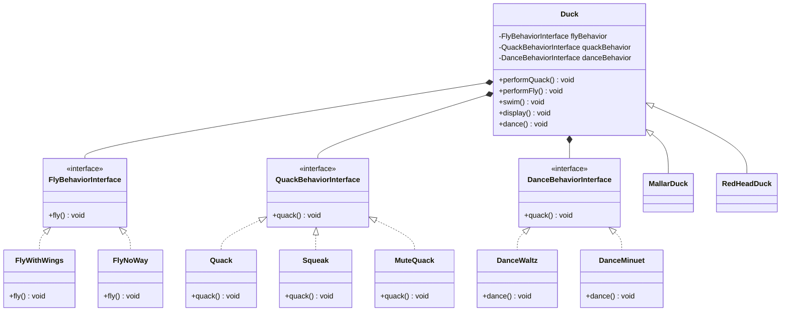

## Утки

```mermaid
classDiagram
    class Duck {
        -FlyBehaviorInterface flyBehavior
        -QuackBehaviorInterface quackBehavior
        -DanceBehaviorInterface danceBehavior

        +performQuack() void
        +performFly() void
        +swim() void
        +display() void
        +dance() void
    }

    class FlyBehaviorInterface {
        <<interface>>
        +fly() void
    }

    class QuackBehaviorInterface {
        <<interface>>
        +quack() void
    }

    class DanceBehaviorInterface {
        <<interface>>
        +quack() void
    }

    class FlyWithWings {
        +fly() void
    }

    class FlyNoWay {
        +fly() void
    }

    class Quack {
        +quack() void
    }

    class Squeak {
        +quack() void
    }

    class MuteQuack {
        +quack() void
    }

    class DanceWaltz {
        +dance() void
    }

    class DanceMinuet {
        +dance() void
    }

    class MallarDuck {
    }

    class RedHeadDuck {
    }

    Duck *-- FlyBehaviorInterface
    Duck *-- QuackBehaviorInterface
    Duck *-- DanceBehaviorInterface

    FlyBehaviorInterface <|.. FlyWithWings
    FlyBehaviorInterface <|.. FlyNoWay

    QuackBehaviorInterface <|.. Quack
    QuackBehaviorInterface <|.. Squeak
    QuackBehaviorInterface <|.. MuteQuack

    DanceBehaviorInterface <|.. DanceWaltz
    DanceBehaviorInterface <|.. DanceMinuet

    Duck <|-- MallarDuck
    Duck <|-- RedHeadDuck
```