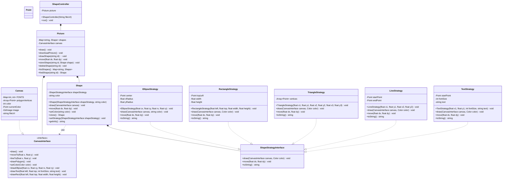

## Фигуры

```mermaid
classDiagram
    class CanvasInterface {
        <<interface>>
        +draw() void
        +moveTo(float x, float y) void
        +lineTo(float x, float y) void
        +drawPolygon() void
        +setColor(Color color) void
        +drawEllipse(float cx, float cy, float rx, float ry) void
        +drawText(float left, float top, int fontSize, string text) void
        +drawRect(float left, float top, float width, float height) void
    }

    class Canvas {
        -Map~int, int~ FONTS
        -Array~Point~ polygonVertices
        -int color
        -Point currentColor
        -GdImage image
        -string fileUrl
    }

    class Point {

    }

    class Shape {
        -ShapeStrategyInterface shapeStrategy
        -string color

        +Shape(ShapeStrategyInterface shapeStrategy, string color)

        +draw(CanvasInterface canvas) void
        +move(float dx, float dy) void
        +setColor(string color) void
        +clone() Shape
        +setStrategy(ShapeStrategyInterface shapeStrategy) void
        +getInfo() string
    }

    class Picture {
        -Map~string, Shape~ shapes
        -CanvasInterface canvas

        +draw() void
        +downloadPicture() void
        +drawShape(string id): void
        +move(float dx, float dy) void
        +storeShape(string id, Shape shape) void
        +deleteShape(string id) void
        +listShapes() Map~string, Shape~
        +findShape(string id) Shape
    }

    class ShapeStrategyInterface {
        +draw(CanvasInterface canvas, Color color) void
        +move(float dx, float dy) void
        +toString() string
    }

    class EllipseStrategy {
        -Point center
        -float xRadius
        -float yRadius

        +EllipseStrategy(float cx, float cy, float rx, float ry) void
        
        +draw(CanvasInterface canvas, string color) void
        +move(float dx, float dy) void
        +toString() string
    }

    class RectangleStrategy {
        -Point topLeft
        -float width
        -float height

        +RectangleStrategy(float left, float top, float width, float height) void
        
        +draw(CanvasInterface canvas, Color color) void
        +move(float dx, float dy) void
        +toString() string
    }

    class TriangleStrategy {
        -Array~Point~ vertices

        +TriangleStrategy(float x1, float y1, float x2, float y2, float x3, float y3) void
        
        +draw(CanvasInterface canvas, Color color) void
        +move(float dx, float dy) void
        +toString() string
    }

    class LineStrategy {
        -Point startPoint
        -Point endPoint

        +LineStrategy(float x1, float y1, float x2, float y2) void
        
        +draw(CanvasInterface canvas, Color color) void
        +move(float dx, float dy) void
        +toString() string
    }

    class TextStrategy {
        -Point startPoint
        -int fontSize
        -string text

        +TextStrategy(float x1, float y1, int fontSize, string text) void
        
        +draw(CanvasInterface canvas, Color color) void
        +move(float dx, float dy) void
        +toString() string
    }

    class ShapeController {
        -Picture picture

        +ShapeController(String fileUrl)
        +run() void
    }

    ShapeController *-- Picture

    Canvas ..|> CanvasInterface
    Picture *-- CanvasInterface
    Shape ..> CanvasInterface : use

    Picture *-- Shape
    Shape *-- ShapeStrategyInterface
    
    EllipseStrategy  ..|> ShapeStrategyInterface

    RectangleStrategy ..|> ShapeStrategyInterface
    TriangleStrategy ..|> ShapeStrategyInterface
    LineStrategy ..|> ShapeStrategyInterface
    TextStrategy ..|> ShapeStrategyInterface

```