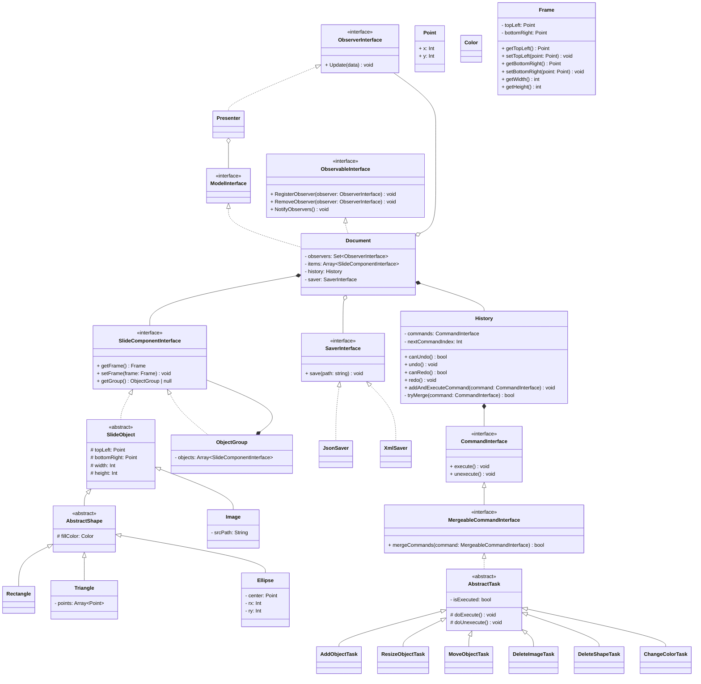

```mermaid
classDiagram
    class ObserverInterface {
        <<interface>>
        + Update(data) void
    }

    class ObservableInterface {
        <<interface>>
        + RegisterObserver(observer: ObserverInterface) void
        + RemoveObserver(observer: ObserverInterface) void
        + NotifyObservers() void
    }

    class SlideObject {
        <<abstract>>
        # topLeft: Point
        # bottomRight: Point
        # width: Int
        # height: Int
    }

    class AbstractShape {
        <<abstract>>
        # fillColor: Color
    }

    class Rectangle {

    }

    class Triangle {
        - points: Array~Point~
    }

    class Ellipse {
        - center: Point
        - rx: Int
        - ry: Int
    }

    class Image {
        - srcPath: String

    }

    class ObjectGroup {
        - objects: Array~SlideComponentInterface~
    }

    class SlideComponentInterface {
        <<interface>>

        + getFrame() Frame
        + setFrame(frame: Frame) void
        + getGroup() ObjectGroup | null
    }

    class ModelInterface {
        <<interface>>
    %% команды по изменению модели документа %%
    }

    class History {
        - commands: CommandInterface
        - nextCommandIndex: Int

        + canUndo() bool
        + undo() void
        + canRedo() bool
        + redo() void
        + addAndExecuteCommand(command: CommandInterface) void

        - tryMerge(command: CommandInterface) bool
    }

    class Document {
        - observers: Set~ObserverInterface~
        - items: Array~SlideComponentInterface~
        - history: History
        - saver: SaverInterface

    }

    class SaverInterface {
        <<interface>>
        + save(path: string) void
    }

    class JsonSaver {

    }

    class XmlSaver {

    }

    class Presenter {
    %% команды по изменению модели документа и вьюхи %%
    }


    class MergeableCommandInterface {
        <<interface>>
        + mergeCommands(command: MergeableCommandInterface) bool
    }

    class CommandInterface {
        <<interface>>
        + execute() void
        + unexecute() void
    }

    class AbstractTask {
        <<abstract>>
        - isExecuted: bool

        # doExecute() void
        # doUnexecute() void
    }

    class AddObjectTask {

    }

    class ResizeObjectTask {

    }

    class MoveObjectTask {

    }

    class DeleteShapeTask {

    }

    class DeleteImageTask {

    }

    class ChangeColorTask {

    }

    class Point {
        + x: Int
        + y: Int
    }

    class Color {

    }

    class Frame {
        - topLeft: Point
        - bottomRight: Point

        + getTopLeft() Point
        + setTopLeft(point: Point) void
        + getBottomRight() Point
        + setBottomRight(point: Point) void
        + getWidth() int
        + getHeight() int
    }

    ObjectGroup *-- SlideComponentInterface
    SlideComponentInterface <|.. SlideObject
    SlideComponentInterface <|.. ObjectGroup

    SlideObject <|-- AbstractShape

    AbstractShape <|-- Rectangle
    AbstractShape <|-- Triangle
    AbstractShape <|-- Ellipse
    SlideObject <|-- Image

    ModelInterface <|.. Document
    Document *-- History
    Document *-- SlideComponentInterface
    Document o-- SaverInterface
    Document o-- ObserverInterface

    History *-- CommandInterface

    Presenter o-- ModelInterface

    SaverInterface <|.. JsonSaver
    SaverInterface <|.. XmlSaver

    CommandInterface <|-- MergeableCommandInterface
    MergeableCommandInterface <|.. AbstractTask

    AbstractTask <|-- AddObjectTask
    AbstractTask <|-- ResizeObjectTask
    AbstractTask <|-- MoveObjectTask
    AbstractTask <|-- DeleteImageTask
    AbstractTask <|-- DeleteShapeTask
    AbstractTask <|-- ChangeColorTask

    ObservableInterface <|.. Document
    ObserverInterface <|.. Presenter
```
