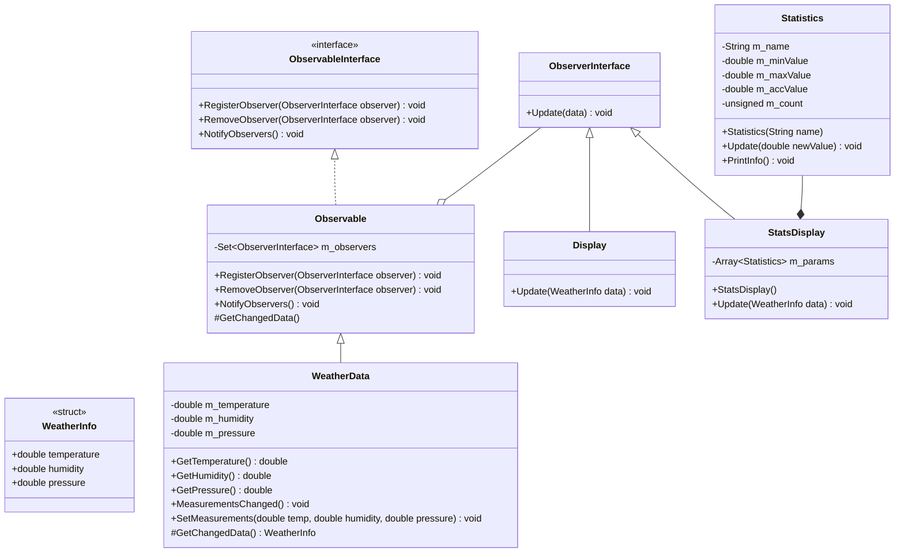

```mermaid
classDiagram
    direction BT
    class WeatherInfo {
        <<struct>>
        +double temperature
        +double humidity
        +double pressure
    }
    class WeatherData {
        -double m_temperature
        -double m_humidity
        -double m_pressure

        +GetTemperature() double
        +GetHumidity() double
        +GetPressure() double
        +MeasurementsChanged() void
        +SetMeasurements(double temp, double humidity, double pressure) void
        #GetChangedData() WeatherInfo
    }

    class Observable {
        -Set~ObserverInterface~ m_observers

        +RegisterObserver(ObserverInterface observer) void
        +RemoveObserver(ObserverInterface observer) void
        +NotifyObservers() void

        #GetChangedData()
    }

    class ObservableInterface {
        <<interface>>
        +RegisterObserver(ObserverInterface observer) void
        +RemoveObserver(ObserverInterface observer) void
        +NotifyObservers() void
    }

    class ObserverInterface {
        +Update(data) void
    }

    class Display {
        +Update(WeatherInfo data) void
    }

    class StatsDisplay {
        -Array~Statistics~ m_params
        +StatsDisplay()
        +Update(WeatherInfo data) void
    }

    class Statistics {
        -String m_name
        -double m_minValue
        -double m_maxValue
        -double m_accValue
        -unsigned m_count

        +Statistics(String name)
        +Update(double newValue) void
        +PrintInfo() void
    }

    Observable ..|> ObservableInterface
    WeatherData --|> Observable

    Display --|> ObserverInterface
    StatsDisplay --|> ObserverInterface

    Observable o-- ObserverInterface

    StatsDisplay *-- Statistics

    %% WeatherData ..> WeatherInfo : create
    %% Display ..> WeatherInfo : use
    %% StatsDisplay ..> WeatherInfo : use

```