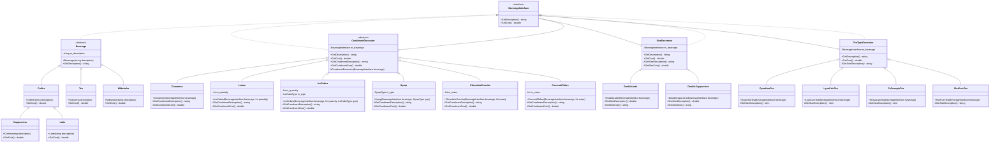

```mermaid
classDiagram
    direction BT
    class BeverageInterface {
        <<interface>>
        +GetDescription() string
        +GetCost() double
    }

    class Beverage {
        <<abstract>>
        -string m_description
        +Beverage(string description)
        +GetDescription() string
    }

    class Coffee {
        +Coffee(string description)
        +GetCost() double
    }

    class Cappuccino {
        +Coffee(string description)
        +GetCost() double
    }

    class Latte {
        +Latte(string description)
        +GetCost() double
    }

    class Tea {
        +Tea(string description)
        +GetCost() double
    }

    class Milkshake {
        +Milkshake(string description)
        +GetCost() double
    }

    class CondimentDecorator {
        -BeverageInterface m_beverage
        <<abstract>>
        +GetDescription() string
        +GetCost() double
        +GetCondimentDescription()* string
        +GetCondimentCost()* double

        #CondimentDecorator(BeverageInterface beverage)
    }

    class Cinnamon {
        +Cinnamon(BeverageInterface beverage)
        #GetCondimentDescription() string
        #GetCondimentCost() double
    }

    class Lemon {
        -Int m_quantity
        +IceCubes(BeverageInterface beverage, Int quantity)
        #GetCondimentDescription() string
        #GetCondimentCost() double
    }

    class IceCubes {
        -Int m_quantity
        -IceCubeType m_type
        +IceCubes(BeverageInterface beverage, Int quantity, IceCubeType type)
        #GetCondimentDescription() string
        #GetCondimentCost() double
    }

    class Syrup {
        -SyrupType m_type
        +Syrup(BeverageInterface beverage, SyrupType type)
        #GetCondimentDescription() string
        #GetCondimentCost() double
    }

    class ChocolateCrumbs {
        -Int m_mass
        +ChocolateCrumbs(BeverageInterface beverage, Int mass)
        #GetCondimentDescription() string
        #GetCondimentCost() double
    }

    class CoconutFlakes {
        -Int m_mass
        +CoconutFlakes(BeverageInterface beverage, Int mass)
        #GetCondimentDescription() string
        #GetCondimentCost() double
    }

    class SizeDecorator {
        -BeverageInterface m_beverage
        +GetDescription() string
        +GetCost() double
        #GetSizeDescription()* string
        #GetSizeCost()* double
    }

    class TeaTypeDecorator {
        -BeverageInterface m_beverage
        +GetDescription() string
        +GetCost() double
        #GetSizeDescription()* string
    }

    class DoubleLatte {
        +DoubleLatte(BeverageInterface beverage)
        #GetSizeDescription() double
        #GetSizeCost() string
    }

    class DoubleCappuccino {
        +DoubleCapuccino(BeverageInterface beverage)
        #GetSizeDescription() double
        #GetSizeCost() string
    }

    class DyanHunTea {
        +DyanHunTea(BeverageInterface beverage)
        #GetSizeDescription() strin
    }

    class LyunCzinTea {
        +LyunCzinTea(BeverageInterface beverage)
        #GetSizeDescription() strin
    }

    class TeGuanyinTea {
        +TeGuanyinTea(BeverageInterface beverage)
        #GetSizeDescription() strin
    }

    class ShuPuerTea {
        +ShuPuerTea(BeverageInterface beverage)
        #GetSizeDescription() string
    }

    Beverage ..|> BeverageInterface
    CondimentDecorator ..|> BeverageInterface
    CondimentDecorator o-- BeverageInterface

    SizeDecorator o-- BeverageInterface
    SizeDecorator ..|> BeverageInterface

    TeaTypeDecorator o-- BeverageInterface
    TeaTypeDecorator ..|> BeverageInterface

    Coffee --|> Beverage
    Cappuccino --|> Coffee
    Latte --|> Coffee

    Tea --|> Beverage
    Milkshake --|> Beverage

    Cinnamon --|> CondimentDecorator
    Lemon --|> CondimentDecorator
    IceCubes --|> CondimentDecorator
    Syrup --|> CondimentDecorator
    ChocolateCrumbs --|> CondimentDecorator
    CoconutFlakes --|> CondimentDecorator

    DoubleLatte --|> SizeDecorator
    DoubleCappuccino --|> SizeDecorator

    DyanHunTea --|> TeaTypeDecorator
    LyunCzinTea --|> TeaTypeDecorator
    TeGuanyinTea --|> TeaTypeDecorator
    ShuPuerTea --|> TeaTypeDecorator
```