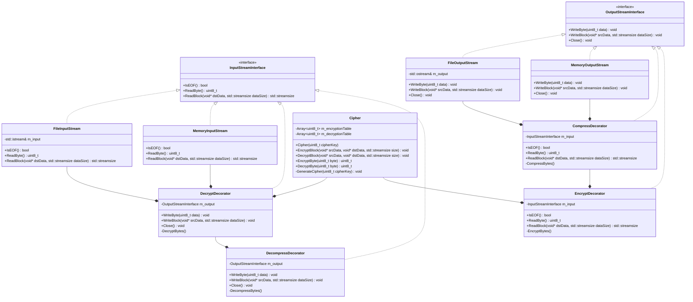

```mermaid
classDiagram
    class InputStreamInterface {
        <<interface>>
        +IsEOF() bool
        +ReadByte() uint8_t
        +ReadBlock(void* dstData, std::streamsize dataSize) std::streamsize
    }

    class FileInputStream {
        -std::istream& m_input
        +IsEOF() bool
        +ReadByte() uint8_t
        +ReadBlock(void* dstData, std::streamsize dataSize) std::streamsize
    }

    class MemoryInputStream {
        +IsEOF() bool
        +ReadByte() uint8_t
        +ReadBlock(void* dstData, std::streamsize dataSize) std::streamsize
    }

    class EncryptDecorator {
        -InputStreamInterface m_input
        +IsEOF() bool
        +ReadByte() uint8_t
        +ReadBlock(void* dstData, std::streamsize dataSize) std::streamsize
        -EncryptBytes()
    }

    class CompressDecorator {
        -InputStreamInterface m_input
        +IsEOF() bool
        +ReadByte() uint8_t
        +ReadBlock(void* dstData, std::streamsize dataSize) std::streamsize
        -CompressBytes()
    }

    class OutputStreamInterface {
        <<interface>>
        +WriteByte(uint8_t data) void
        +WriteBlock(void* srcData, std::streamsize dataSize) void
        +Close() void
    }

    class FileOutputStream {
        -std::ostream& m_output
        +WriteByte(uint8_t data) void
        +WriteBlock(void* srcData, std::streamsize dataSize) void
        +Close() void
    }

    class MemoryOutputStream {
        +WriteByte(uint8_t data) void
        +WriteBlock(void* srcData, std::streamsize dataSize) void
        +Close() void
    }

    class DecryptDecorator {
        -OutputStreamInterface m_output
        +WriteByte(uint8_t data) void
        +WriteBlock(void* srcData, std::streamsize dataSize) void
        +Close() void
        -DecryptBytes()
    }

    class DecompressDecorator {
        -OutputStreamInterface m_output
        +WriteByte(uint8_t data) void
        +WriteBlock(void* srcData, std::streamsize dataSize) void
        +Close() void
        -DecompressBytes()
    }

    class Cipher {
        -Array~uint8_t~ m_encryptionTable
        -Array~uint8_t~ m_decryptionTable

        +Cipher(uint8_t cipherKey)
        +EncryptBlock(void* srcData, void* dstData, std::streamsize size) void
        +DecryptBlock(void* srcData, void* dstData, std::streamsize size) void
        +EncryptByte(uint8_t byte) uint8_t
        +DecryptByte(uint8_t byte) uint8_t

        -GenerateCipher(uint8_t cipherKey) void
    }

    OutputStreamInterface <|.. FileOutputStream
    OutputStreamInterface <|.. MemoryOutputStream
    OutputStreamInterface <|.. CompressDecorator
    OutputStreamInterface <|.. EncryptDecorator

    CompressDecorator --* EncryptDecorator

    FileOutputStream --* CompressDecorator
    MemoryOutputStream --* CompressDecorator

    InputStreamInterface <|.. FileInputStream
    InputStreamInterface <|.. MemoryInputStream
    InputStreamInterface <|.. DecryptDecorator
    InputStreamInterface <|.. DecompressDecorator

    DecryptDecorator --* DecompressDecorator

    FileInputStream --* DecryptDecorator
    MemoryInputStream --* DecryptDecorator

    Cipher --* DecryptDecorator
    Cipher --* EncryptDecorator
```
