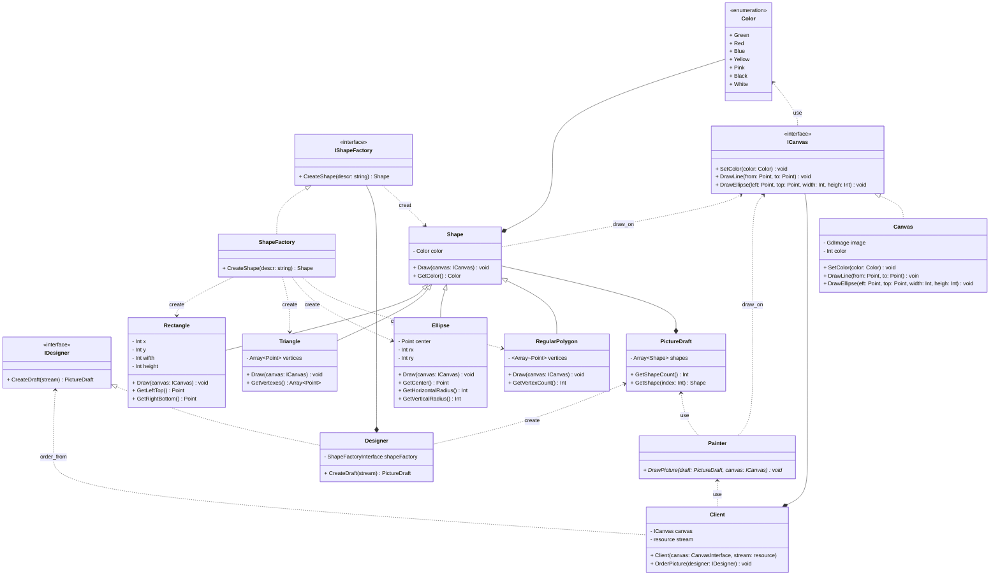

```mermaid
classDiagram
    class IShapeFactory {
        <<interface>>
        + CreateShape(descr: string) Shape
    }

    class IDesigner {
        <<interface>>
        + CreateDraft(stream) PictureDraft
    }

    class Designer {
        - ShapeFactoryInterface shapeFactory

        + CreateDraft(stream) PictureDraft
    }

    class PictureDraft {
        - Array~Shape~ shapes 

        + GetShapeCount() Int
        + GetShape(index: Int) Shape
    }

    class Shape {
        - Color color

        + Draw(canvas: ICanvas) void
        + GetColor() Color
    }

    class Rectangle {
        - Int x
        - Int y
        - Int wifth
        - Int height

        + Draw(canvas: ICanvas) void
        + GetLeftTop() Point
        + GetRightBottom() Point
    }

    class Triangle {
        - Array~Point~ vertices

        + Draw(canvas: ICanvas) void
        + GetVertexes() Array~Point~
    }

    class Ellipse {
        - Point center
        - Int rx
        - Int ry

        + Draw(canvas: ICanvas) void
        + GetCenter() Point
        + GetHorizontalRadius() Int
        + GetVerticalRadius() Int
    }

    class RegularPolygon {
        - ~Array~Point~ vertices

        + Draw(canvas: ICanvas) void
        + GetVertexCount() Int
    }

    class Canvas {
        - GdImage image
        - Int color

        + SetColor(color: Color) void
        + DrawLine(from: Point, to: Point) voin
        + DrawEllipse(eft: Point, top: Point, width: Int, heigh: Int) void
    }

    class ICanvas {
        <<interface>>
        + SetColor(color: Color) void
        + DrawLine(from: Point, to: Point) void
        + DrawEllipse(left: Point, top: Point, width: Int, heigh: Int) void
    }

    class Client {
        - ICanvas canvas
        - resource stream

        + Client(canvas: CanvasInterface, stream: resource)
        + OrderPicture(designer: IDesigner) void
    }

    class Painter {
        + _DrawPicture(draft: PictureDraft, canvas: ICanvas) void_
    }

    class Color {
        <<enumeration>>
        + Green
        + Red
        + Blue
        + Yellow
        + Pink
        + Black
        + White
    }

    class ShapeFactory {
        + CreateShape(descr: string) Shape
    }

    ICanvas <.. Shape : draw_on
    Color --* Shape 
    IShapeFactory <|.. ShapeFactory 

    ShapeFactory ..> Rectangle : create
    ShapeFactory ..> Triangle : create
    ShapeFactory ..> Ellipse : create
    ShapeFactory ..> RegularPolygon : create

    Shape <|-- Rectangle 
    Shape <|-- Triangle
    Shape <|-- Ellipse
    Shape <|-- RegularPolygon
    Shape --* PictureDraft

    PictureDraft <.. Designer : create
    PictureDraft <.. Painter : use
    IShapeFactory --* Designer
    IShapeFactory ..> Shape : creat
    IDesigner <.. Client : order_from
    IDesigner <|.. Designer

    Color <.. ICanvas : use
    Painter <.. Client : use
    ICanvas <.. Painter : draw_on
    ICanvas --* Client
    ICanvas <|.. Canvas

```
