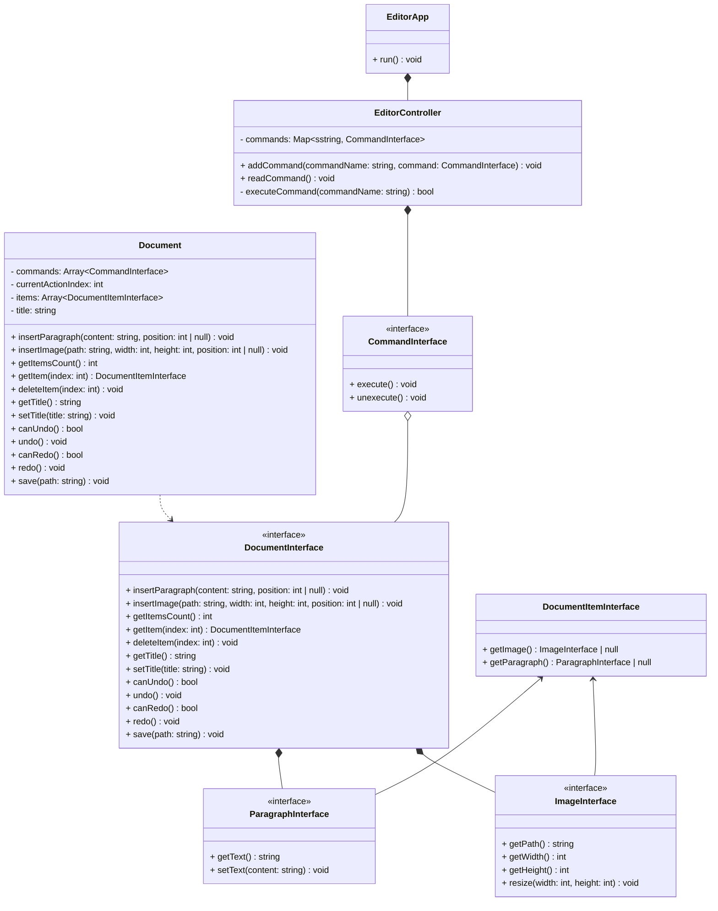

```mermaid
classDiagram
    direction TB
    class DocumentInterface {
        <<interface>>
        + insertParagraph(content: string, position: int | null) void
        + insertImage(path: string, width: int, height: int, position: int | null) void
        + getItemsCount() int
        + getItem(index: int) DocumentItemInterface
        + deleteItem(index: int) void
        + getTitle() string
        + setTitle(title: string) void
        + canUndo() bool
        + undo() void
        + canRedo() bool
        + redo() void
        + save(path: string) void
    }

    class Document {
        - commands: Array~CommandInterface~
        - currentActionIndex: int
        - items: Array~DocumentItemInterface~
        - title: string
        
        + insertParagraph(content: string, position: int | null) void
        + insertImage(path: string, width: int, height: int, position: int | null) void
        + getItemsCount() int
        + getItem(index: int) DocumentItemInterface
        + deleteItem(index: int) void
        + getTitle() string
        + setTitle(title: string) void
        + canUndo() bool
        + undo() void
        + canRedo() bool
        + redo() void
        + save(path: string) void
    }
    
    class ParagraphInterface {
        <<interface>>
        + getText() string
        + setText(content: string) void
    }
    
    class ImageInterface {
        <<interface>>
        + getPath() string
        + getWidth() int
        + getHeight() int
        + resize(width: int, height: int) void
    }
    
    class DocumentItemInterface {
        + getImage() ImageInterface | null
        + getParagraph() ParagraphInterface | null
    }
    
    class CommandInterface {
        <<interface>>
        + execute() void
        + unexecute() void
    }
    
    class EditorController {
        - commands: Map~sstring, CommandInterface~
        
        + addCommand(commandName: string, command: CommandInterface) void
        + readCommand() void
        
        - executeCommand(commandName: string) bool
    }
    
%%    class InsertImageCommand {
%%        - document: DocumentInterface 
%%        
%%        + InsertImageCommand(reciever: DocumentInterface)
%%        + execute() void
%%        + unexecute() void
%%    }
%%
%%    class InsertParagraphCommand {
%%        - document: DocumentInterface
%%
%%        + InsertParagraphCommand(reciever: DocumentInterface)
%%        + execute() void
%%        + unexecute() void
%%    }
%%
%%    class SetTitleCommand {
%%        - document: DocumentInterface
%%
%%        + SetTitleCommand(reciever: DocumentInterface)
%%        + execute() void
%%        + unexecute() void
%%    }
%%
%%    class ListCommand {
%%        - document: DocumentInterface
%%
%%        + ListCommand(reciever: DocumentInterface)
%%        + execute() void
%%        + unexecute() void
%%    }
%%
%%    class ReplaceTextCommand {
%%        - document: DocumentInterface
%%
%%        + ReplaceTextCommand(reciever: DocumentInterface)
%%        + execute() void
%%        + unexecute() void
%%    }
%%
%%    class ResizeImageCommand {
%%        - document: DocumentInterface
%%
%%        + ResizeImageCommand(reciever: DocumentInterface)
%%        + execute() void
%%        + unexecute() void
%%    }
%%
%%    class DeleteItemCommand {
%%        - document: DocumentInterface
%%
%%        + DeleteItemCommand(reciever: DocumentInterface)
%%        + execute() void
%%        + unexecute() void
%%    }
%%
%%    class UndoCommand {
%%        - document: DocumentInterface
%%
%%        + UndoCommand(reciever: DocumentInterface)
%%        + execute() void
%%        + unexecute() void
%%    }
%%
%%    class RedoCommand {
%%        - document: DocumentInterface
%%
%%        + RedoCommand(reciever: DocumentInterface)
%%        + execute() void
%%        + unexecute() void
%%    }
%%    
%%    class SaveCommand {
%%        - document: DocumentInterface
%%
%%        + RedoCommand(reciever: DocumentInterface)
%%        + execute() void
%%        + unexecute() void
%%    }

    class EditorApp {
        + run() void
    }
    
    DocumentInterface *-- ParagraphInterface

    DocumentItemInterface <-- ParagraphInterface
    DocumentItemInterface <-- ImageInterface
    DocumentInterface *-- ImageInterface

    Document ..> DocumentInterface

    
    EditorController *-- CommandInterface
    CommandInterface o-- DocumentInterface
    
    EditorApp *-- EditorController

%%    InsertImageCommand ..> CommandInterface
%%    InsertParagraphCommand ..> CommandInterface
%%    SetTitleCommand ..> CommandInterface
%%    ListCommand ..> CommandInterface
%%    ReplaceTextCommand ..> CommandInterface
%%    ResizeImageCommand ..> CommandInterface
%%    DeleteItemCommand ..> CommandInterface
%%    UndoCommand ..> CommandInterface
%%    RedoCommand ..> CommandInterface
%%    SaveCommand ..> CommandInterface
```