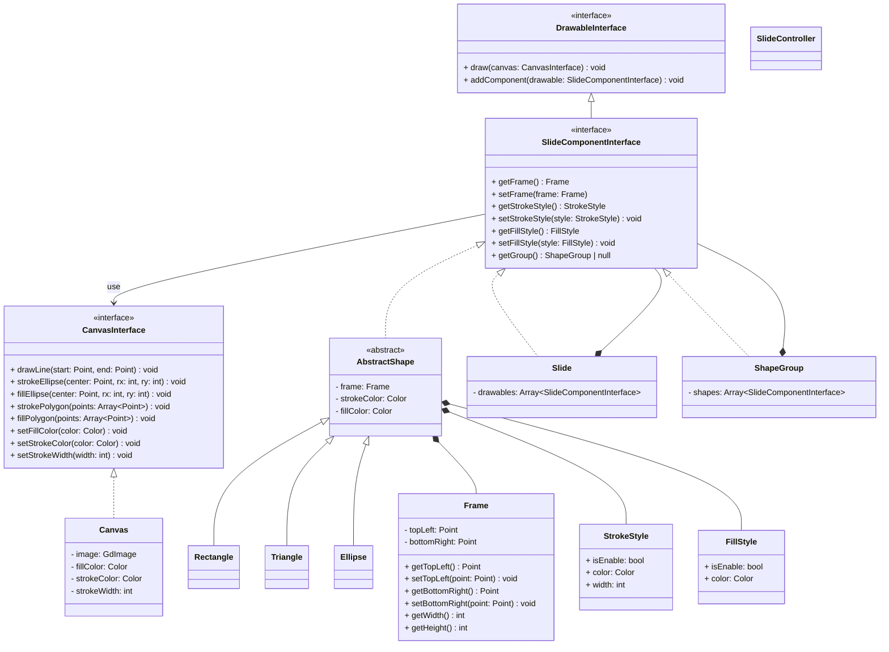

```mermaid
classDiagram
    class StrokeStyle {
        + isEnable: bool
        + color: Color
        + width: int
    }

    class FillStyle {
        + isEnable: bool
        + color: Color
    }

    class Frame {
        - topLeft: Point
        - bottomRight: Point

        + getTopLeft() Point
        + setTopLeft(point: Point) void
        + getBottomRight() Point
        + setBottomRight(point: Point) void
        + getWidth() int
        + getHeight() int
    }

    class CanvasInterface {
        <<interface>>
        + drawLine(start: Point, end: Point) void
        + strokeEllipse(center: Point, rx: int, ry: int) void
        + fillEllipse(center: Point, rx: int, ry: int) void
        + strokePolygon(points: Array~Point~) void
        + fillPolygon(points: Array~Point~) void

        + setFillColor(color: Color) void
        + setStrokeColor(color: Color) void
        + setStrokeWidth(width: int) void
    }

    class Canvas {
        - image: GdImage
        - fillColor: Color
        - strokeColor: Color
        - strokeWidth: int
    }

    class DrawableInterface {
        <<interface>>

        + draw(canvas: CanvasInterface) void
        + addComponent(drawable: SlideComponentInterface) void
    }

    class SlideComponentInterface {
        <<interface>>
        + getFrame() Frame
        + setFrame(frame: Frame)
        + getStrokeStyle() StrokeStyle
        + setStrokeStyle(style: StrokeStyle) void
        + getFillStyle() FillStyle
        + setFillStyle(style: FillStyle) void
        + getGroup() ShapeGroup | null
    }

    class AbstractShape {
        <<abstract>>
        - frame: Frame
        - strokeColor: Color
        - fillColor: Color
    }

    class Slide {
        - drawables: Array~SlideComponentInterface~
    }

    class Rectangle {

    }

    class Triangle {

    }

    class Ellipse {

    }

    class ShapeGroup {
        - shapes: Array~SlideComponentInterface~
    }

    class SlideController {

    }

    CanvasInterface <|.. Canvas
    DrawableInterface <|-- SlideComponentInterface

    SlideComponentInterface --> CanvasInterface : use

    AbstractShape <|-- Rectangle
    AbstractShape <|-- Triangle
    AbstractShape <|-- Ellipse

    AbstractShape *-- Frame
    AbstractShape *-- StrokeStyle
    AbstractShape *-- FillStyle

    SlideComponentInterface <|.. AbstractShape
    SlideComponentInterface <|.. ShapeGroup
    SlideComponentInterface <|.. Slide

    ShapeGroup *-- SlideComponentInterface
    Slide *-- SlideComponentInterface
```